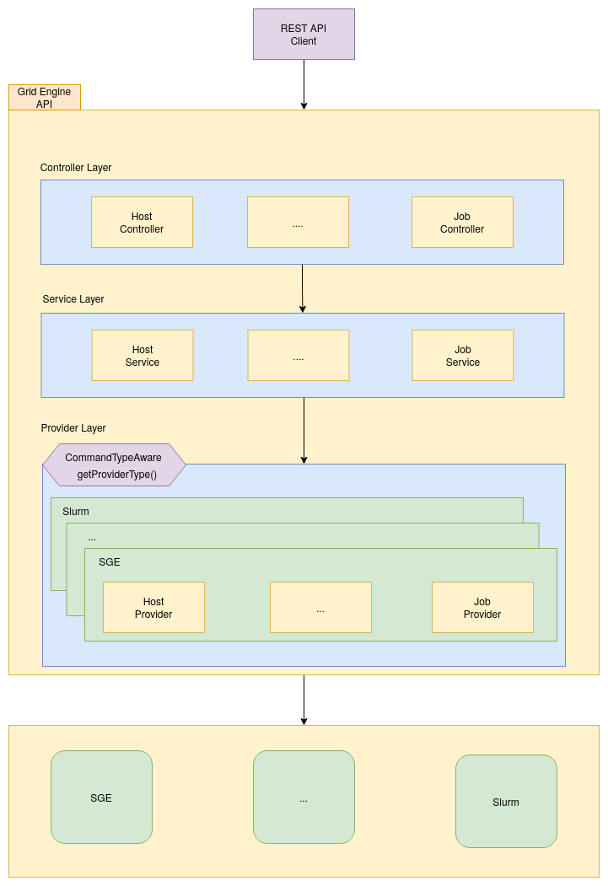

## GRID-ENGINE-API
____
### Table of contents
_____
* [Introduction](#introduction)
* [Features](#features)
* [Build process](#build-process)
  * [Using jar file](#using-jar-file)
  * [Using docker](#using-docker)
* [System overview](#system-overview)
* [API Reference](#api-reference)
* [Developer guide](#developer-guide)

### Introduction
______
This is a RESTful API which provides a convenient way for interaction with different types of grid engines (SGE, SLURM, etc.)

### Features
____
- Helps to unify work with different types of grid engines
- Allows to simplify interaction with different grid engines for other services
- Provides remote interaction with grid engines

### Build process
________
To build and run this application locally you'll need Java 11 or later, Git and Docker to be installed on your computer.
From your command line:
### *Using jar file*

````
# Clone this repository
$ git clone https://github.com/ekazachkova/grid-engine-api.git

# Go into the repository
$ cd grid-engine-api

# Build
$ ./gradlew build

# Run the app
$ java -jar build/libs/grid-engine-api-1.0-SNAPSHOT.jar
````
### *Using docker*
```
# Clone this repository
$ git clone https://github.com/ekazachkova/grid-engine-api.git

# Go into the repository
$ cd grid-engine-api

# Build
$ ./gradlew build

# Build Docker image
$ docker build -f ./docker/Dockerfile -t grid-engine-api:latest .

# Run Docker image
$ docker run -d -p 8080:8080 grid-engine-api:latest 
```

For more information please [see](docker/README.md)

### System overview
____
The figure shows schematically how the application is arranged. It is logically divided into three levels:
1. API - provides an interface for interacting with the application;
2. Service - connects the API with the provider;
3. Provider - implements interaction of the application directly with the underlying client of the cluster
(SGE, Slurm, etc).




Now lets see with example how application works:
- A client sends a request to GRID-ENGINE-API.
- At the controller layer the request is processed by the appropriate controller and redirected to the service layer.
- At the service layer a required grid engine type and an appropriate provider are determined.
- Then the determined provider refers to the corresponding grid engine client, gets output, maps it to `unified` object
model  and returns it back to the Rest API client.

### API Reference
_____
API Reference docs can be found [here](docs/api) 

### Developer guide
_____
Developer guide can be found [here](docs/developer_guide/developer_guide.md)
